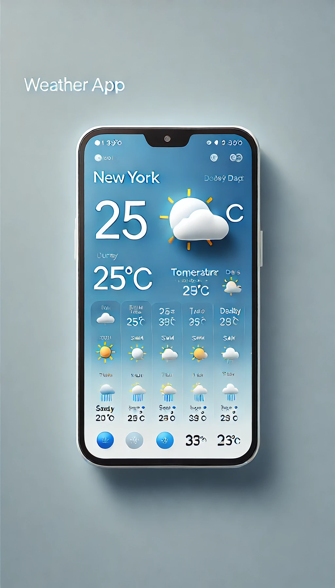
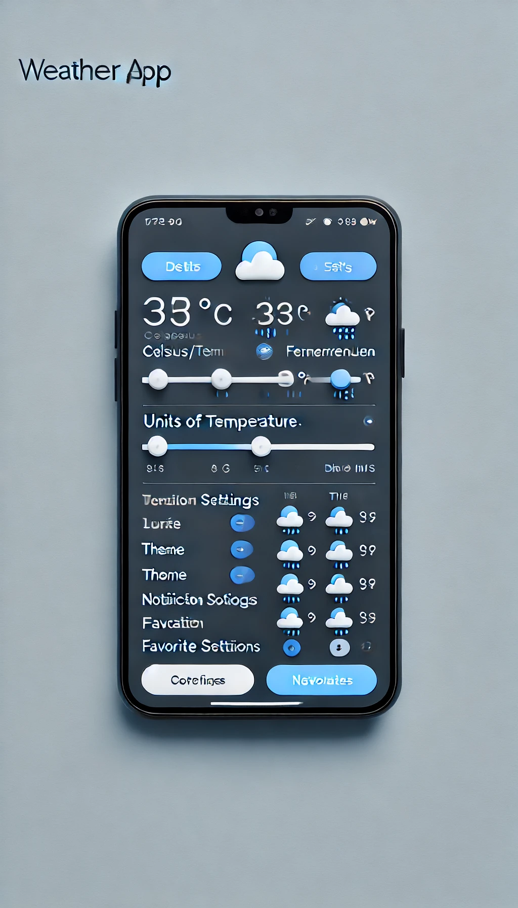
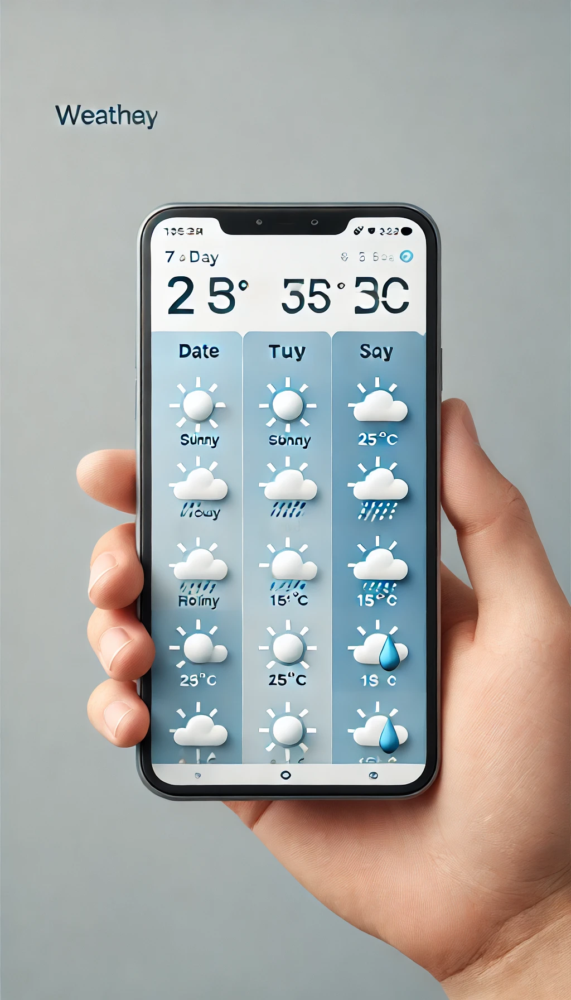

# 🌦 Weather Android App

A **Weather Android App** that provides real-time weather updates, 7-day forecasts, and additional weather-related information, such as humidity, UV index, and wind speed. This app leverages an external weather API and showcases best practices in Android development, utilizing libraries like Jetpack, Retrofit, and LiveData. It’s designed for Android developers who want to build a fully-functional, user-friendly weather application with modern features and seamless performance.
The app leverages a weather API, such as OpenWeatherMap or Weatherstack, to fetch data. Core features include location-based weather updates, where the app uses GPS to fetch the user’s current location or allows manual city search. A clean UI can incorporate dynamic weather icons, temperature displays (in Celsius and Fahrenheit), and weather animations for rain, sun, or snow conditions, enhancing the user experience. A daily and weekly forecast page provides insights into upcoming weather, with detailed hourly breakdowns to plan activities effectively. Additional functionality includes push notifications for severe weather alerts, customizable themes (e.g., light and dark mode), and saving favorite cities for quick access. Background services handle periodic data refresh, ensuring up-to-date information. The app should support offline data caching, providing the last known data if the user is disconnected. Incorporating Jetpack libraries like LiveData and ViewModel ensures smooth data handling and UI updates, while Retrofit or Volley assists with network requests. A settings page allows users to customize preferences like units of measurement and notification settings.


## 📱 Screenshots





## 📖 Features

- **Real-Time Weather Data**: Access real-time weather data based on the user’s current location or selected city.
- **7-Day Forecast**: Detailed daily and hourly weather forecast.
- **Customizable UI**: Dynamic weather icons and animations for conditions such as rain, sun, and snow.
- **Severe Weather Alerts**: Push notifications to alert users of severe weather.
- **Offline Data Caching**: Displays the last known data when offline.
- **Light & Dark Mode**: Theme support to suit user preferences.
- **Favorites**: Save favorite locations for quick weather checks.
  
## 📚 Learning Outcomes

By completing this project, students will learn how to:

- **Integrate APIs in Android**: Use external APIs (e.g., OpenWeatherMap) to fetch data, handle JSON responses, and display information within the app.
- **Implement Jetpack Libraries**: Use Jetpack components like LiveData, ViewModel, and DataBinding for efficient state management.
- **Handle Background Services**: Set up periodic data refreshes using WorkManager for up-to-date information.
- **Create an Interactive UI**: Design engaging UI elements with Material Design, dynamic icons, animations, and themes.
- **Optimize Network Requests**: Implement Retrofit for network operations and handle network calls efficiently.
- **Manage Offline Data**: Store data locally to allow offline usage, enhancing the app’s accessibility.
  
These skills will provide a strong foundation for developing modern Android applications that prioritize user experience and performance.

## 🚀 Getting Started

### Prerequisites

- **Android Studio** (latest version)
- **Weather API Key** (from OpenWeatherMap or Weatherstack)

## 🚀 Static Assets
- **[Icons](https://www.amcharts.com/free-animated-svg-weather-icons/)** 

- **[Icons](https://www.svgrepo.com/svg/427015/weather-icons-44/)**

### Installation

1. **Clone this repository**:
   ```bash
   git clone https://github.com/anirudhagaikwad/Weather.git

